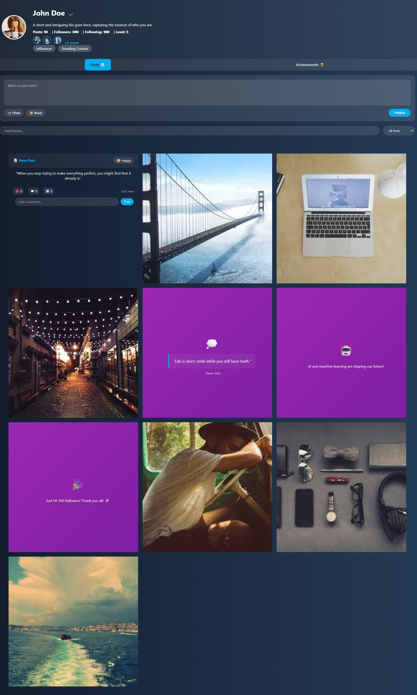
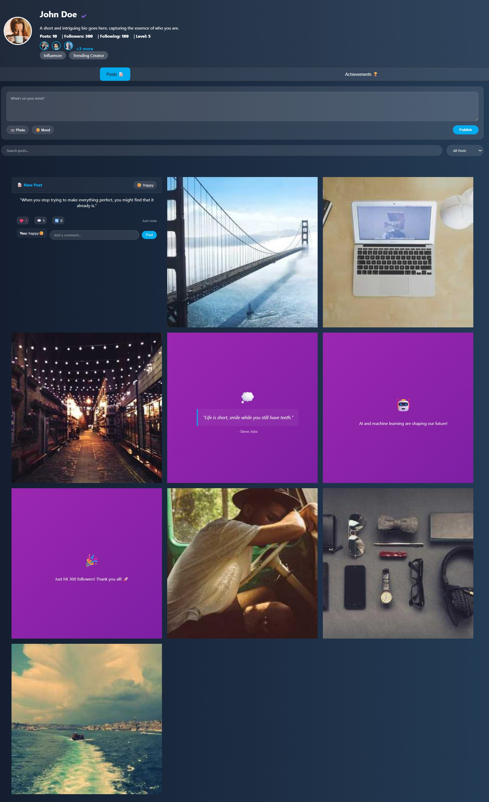
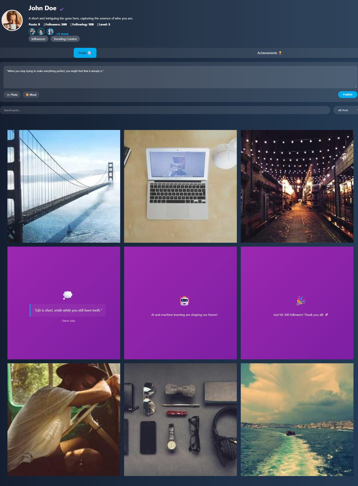
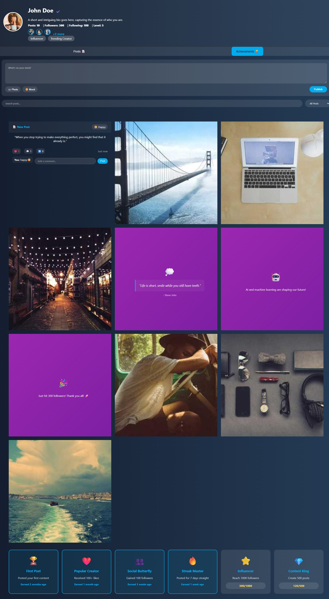

# 🟣 Profile Page

A beautiful, interactive social media profile page with a stunning theme and  layout.

## ✨ Features

- **Theme**: Beautiful gradient background and accents
- **Layout**: Organized posts in a clean grid format
- **Interactive Posts**: Like, comment, and share functionality
- **Post Creation**: Create new posts with text area
- **Search & Filter**: Search posts and filter by type
- **Achievements System**: Track progress and earned badges
- **Responsive Design**: Works on desktop and mobile
- **Smooth Animations**: Hover effects and transitions

## 🚀 How to Use

1. Open `index.html` in your browser
2. **Create Posts**: Write in the text area and click "Publish"
3. **Interact**: Hover over posts to see like/comment/share options
4. **Search**: Use the search bar to find specific posts
5. **Filter**: Use dropdown to filter by post type
6. **Achievements**: Check the Achievements tab for progress

## 📁 Files

- `index.html` - Main HTML structure
- `styles.css` - theme and grid styling
- `script.js` - Interactive functionality

## 🎨 Design

- **Colors**: gradient (#4a148c to #9c27b0)
- **Layout**: 3x3 responsive grid
- **Posts**:  photos +  text/quote posts
- **Interactions**: Hover overlays with smooth animations

## 📱 Responsive

- Desktop:  layout
- Mobile: Single column layout
- All interactions work on touch devices

## 📸 Screenshots

### Main Profile Page

*Beautiful purple-themed profile with user stats and navigation*

### Posts Grid Layout

*Clean  showing photos and text posts*

### Interactive Features

*Posts with likes, comments, and shares after user interaction*

### Post Creation

*Create new posts with the built-in text editor*

### Achievements System

*Track your progress with earned badges and milestones*

Enjoy your beautiful profile page! 💜

####author:Praviksha r shetty